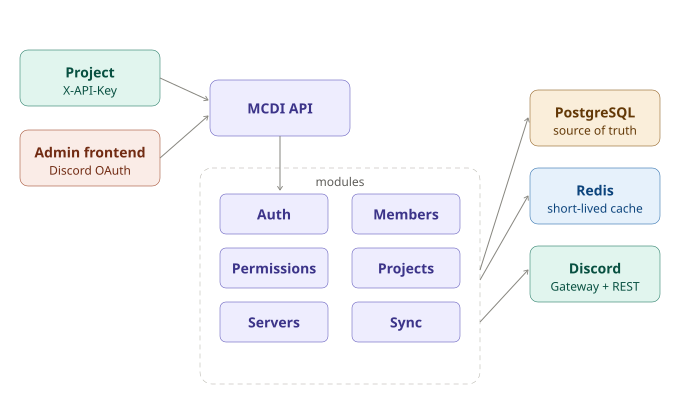
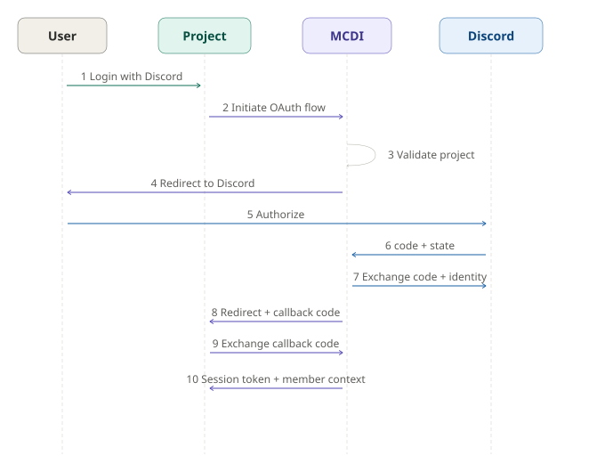
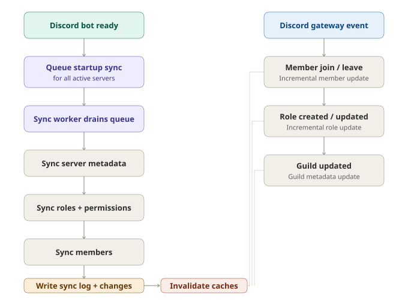

# MCDI: Centralized Discord Identity And Access Service

Built and maintained by the Dev Department of MicroClub, the computer science club at USTHB (University of Science and Technology Houari Boumediene, Algiers).

MCDI, short for **MicroClub Discord Interface**, is the backend service that centralizes Discord authentication, member synchronization, permission resolution, and project access control for MicroClub applications. Instead of each app implementing its own Discord login, guild checks, and role logic, projects integrate once with MCDI and consume a documented API.

The current codebase ships a production-oriented NestJS backend with PostgreSQL, Redis-backed caching, Discord bot synchronization, Swagger documentation, multi-server administration, and project-scoped OAuth flows.

## Table of Contents

- [Features](#features)
- [Quick Start](#quick-start)
- [Configuration](#configuration)
- [Authentication Model](#authentication-model)
- [Architecture](#architecture)
- [Deployment](#deployment)
- [Use Cases](#use-cases)
- [Requirement Docs](#requirement-docs)
- [Future Extensions](#future-extensions)
- [Contributing](#contributing)
- [License](#license)

## Features

- **Discord OAuth for MicroClub projects**: browser redirect flow with validated `client_id`, `redirect_uri`, `server_id`, and CSRF `state`
- **Project-scoped API keys**: projects authenticate to MCDI through `X-API-Key`, with hash-only storage and one-time secret reveal
- **Secure session exchange**: Discord callback returns a short-lived code, then the project backend exchanges it for a long-lived session token
- **Admin Discord login**: Executive members of the configured main guild can access admin endpoints through Discord OAuth
- **Member directory API**: fetch one member, search members in a server, and retrieve effective permissions
- **Permission resolution engine**: single checks, batch checks (`ALL` / `ANY`), and inheritance rules across servers
- **Multi-server management**: register servers, mark a main server, enable or disable a guild, and inspect sync health
- **Project-server access matrix**: grant scopes and operations per project/server pair, with audit history
- **Automatic Discord synchronization**: startup sync, manual queued syncs, and real-time updates from Discord gateway events
- **Operational visibility**: sync status, sync logs, granular change history, Swagger docs, and validation-first API behavior

## Quick Start

There are two practical ways to run MCDI locally.

### Run With Docker Compose

1. Copy the environment template:

```bash
cp .env.example .env
```

| Area | Capabilities |
|---|---|
| **OAuth** | Project-scoped browser flows with CSRF state, validated `client_id` and `redirect_uri` |
| **API Keys** | Hash-only storage, one-time secret reveal, per-project scopes |
| **Sessions** | Short-lived callback codes exchanged for long-lived project session tokens |
| **Admin Access** | Discord OAuth gated by a configured admin role ID in the main guild |
| **Members** | Fetch by ID, search within a server, resolve effective permissions |
| **Permissions** | Single and batch checks (`ALL` / `ANY`), inheritance across servers |
| **Multi-server** | Register guilds, set a main server, enable/disable, inspect sync health |
| **Access Matrix** | Grant scopes per project/server pair with full audit history |
| **Sync** | Startup sync, manual queued syncs, live Discord gateway events |
| **Observability** | Sync logs, change history, Swagger UI, strict DTO validation |

---

```env
DISCORD_CLIENT_ID=
DISCORD_CLIENT_SECRET=
DISCORD_TOKEN=
DISCORD_CALLBACK_URL=http://localhost:3000/api/auth/discord/callback
DISCORD_ADMIN_CALLBACK_URL=http://localhost:3000/api/auth/admin/discord/callback
MC_GUILD_ID=
ADMIN_FRONTEND_URL=http://localhost:5173
```

3. Start the stack:

```bash
docker-compose up --build -d
```

4. Open the service:

- API base URL: [http://localhost:3000/api](http://localhost:3000/api)
- Swagger UI: [http://localhost:3000/api/docs](http://localhost:3000/api/docs)

The compose stack starts:

- the NestJS API
- PostgreSQL
- Redis

### Run From Source

```bash
npm install
cp .env.example .env
npm run db:push
npm run start:dev
```

Optional helpers:

```bash
npm run db:seed
npm run test
npm run test:e2e
```

## Configuration

MCDI is configured through environment variables loaded from `.env`.

### Required

| Variable | Description |
| --- | --- |
| `DATABASE_URL` | PostgreSQL connection string used by Drizzle and the API |
| `DISCORD_CLIENT_ID` | Discord OAuth application client ID |
| `DISCORD_CLIENT_SECRET` | Discord OAuth application client secret |
| `DISCORD_TOKEN` | Discord bot token used for guild sync and role inspection |
| `DISCORD_CALLBACK_URL` | OAuth callback for project member login |
| `DISCORD_ADMIN_CALLBACK_URL` | OAuth callback for admin login |
| `MC_GUILD_ID` | Main MicroClub guild for admin access verification |
| `MC_EXECUTIVE_ROLE_ID` | Discord role ID that grants admin access in the main guild |
| `ADMIN_FRONTEND_URL` | Redirect target after successful admin login |

### Common Optional Settings

| Variable | Default | Description |
| --- | --- | --- |
| `APP_PORT` / `PORT` | `3000` | HTTP port |
| `API_PREFIX` | `api` | Global API prefix |
| `BASE_URL` | `http://localhost:3000` | Public base URL used in redirects and docs |
| `REDIS_HOST` | `localhost` | Redis host |
| `REDIS_PORT` | `6379` | Redis port |
| `REDIS_PASSWORD` | none | Redis password |
| `REDIS_KEY_PREFIX` | `mcdi` | Redis namespace prefix |
| `PERMISSION_CACHE_TTL_MS` | `300000` | In-memory permission cache TTL |
| `PROJECT_AUTH_CACHE_TTL_MS` | `30000` | Redis cache TTL for project auth lookups |
| `PROJECT_ACCESS_CACHE_TTL_MS` | `30000` | Redis cache TTL for project-server access |
| `PROJECT_LAST_USED_WRITE_TTL_MS` | `60000` | Write-throttling window for API key last-used updates |
| `AUTH_REQUEST_TTL_SEC` | `600` | TTL for pre-OAuth auth requests |
| `OAUTH_STATE_TTL_SEC` | `600` | TTL for Discord OAuth state rows |
| `CALLBACK_CODE_TTL_SEC` | `120` | TTL for one-time callback codes |
| `SESSION_TTL_SEC` | `2592000` | TTL for project session tokens |

## Authentication Model

MCDI uses two different authentication models depending on who is calling it.

### 1. Project To MCDI

Projects authenticate with `X-API-Key`.

There are **two entry points** to start a user login. They share the same callback, the same token exchange, and the same session API — they only differ in whether MCDI checks the global SSO cookie before bouncing to Discord:

| Entry point | Behavior | When to use |
|---|---|---|
| `GET /api/auth/sso/authorize` | SSO-aware: skips Discord if the browser already has a valid `mcdi_sso` cookie. | Default "Login with MicroClub" button. Returning users get instant logins across every MCDI project. |
| `GET /api/auth/authorize` | Legacy: always bounces through Discord. | Step-up / "force re-auth" — admin actions, sensitive changes — or unchanged behavior for pre-SSO integrations. |

Typical flow (both entry points):

1. The frontend redirects the user to MCDI
2. MCDI validates the project, redirect URI, and server access
3. The user authenticates with Discord (or skips it if SSO-aware and the cookie is valid)
4. MCDI verifies guild membership and project access rules
5. MCDI redirects back to the project with a one-time `code`
6. The project backend exchanges the code for a session token
7. The project validates sessions when needed

See [docs/auth-integration.md](docs/auth-integration.md) for the full integrator guide with code samples, sequence diagrams, and the SSO-only browser endpoints (`/sso/session`, `/sso/sessions`, `/sso/logout`).

### 2. Admin To MCDI

Admins authenticate through Discord OAuth and receive a bearer session.

Admins log in via Discord OAuth and receive a bearer session token. Access is restricted to members who hold the configured admin role ID in the configured main guild.

- are in the configured main guild
- hold the `Executive` role in that guild

## Architecture

### System Overview

<p align="center">
  
</p>

### Project Login Flow

<p align="center">
  
</p>

### Discord Sync Lifecycle

<p align="center">
  
</p>

### Design Decisions

- **Modules**: `auth`, `members`, `permissions`, `projects`, `servers`, `sync`, `admin-members` — each owns its domain.
- **PostgreSQL** is the source of truth for projects, sessions, members, roles, access mappings, and sync logs.
- **Redis** handles short-lived project auth and access caching, reducing Discord API round-trips.
- **In-memory permission cache** makes repeated permission checks fast within a process lifetime.
- **Validation-first**: all DTOs are validated globally; non-whitelisted fields are rejected.
- **Swagger** is generated directly from NestJS controllers and DTOs — always in sync with the actual API.

---

## Deployment

### Development

Use Docker Compose for the easiest development setup:

```bash
docker-compose up --build -d
```

Useful scripts:

```bash
npm run docker:up
npm run docker:up:build
npm run docker:down
npm run docker:logs
npm run docker:db:push
npm run docker:db:seed
```

### Production

The repository includes a multi-stage production `Dockerfile`.

Build and run manually:

```bash
docker build -t mcdi:local .
docker run --env-file .env -p 3000:3000 mcdi:local
```

At runtime, the production container expects:

- a reachable PostgreSQL instance
- a reachable Redis instance
- valid Discord OAuth credentials
- a valid Discord bot token if sync and live guild features are needed

## Use Cases

- **MicroClub apps**: central login and role-aware access control for internal tools
- **Event platforms**: gate event actions based on Discord membership and role permissions
- **Admin operations**: inspect cross-server participation and export member data
- **Competition servers**: manage separate guilds while preserving shared identity rules
- **Future integrations**: use MCDI as the identity and authorization layer for new club products

## Requirement Docs

The repository now keeps requirements and architecture notes under `docs/`:

- [docs/specefication_document_mvp.md](/Users/destockphonedz/Documents/MCDI/MCDI/docs/specefication_document_mvp.md): current release scope and implemented requirements
- [docs/specefication_document_last_version.md](/Users/destockphonedz/Documents/MCDI/MCDI/docs/specefication_document_last_version.md): next-phase roadmap and architecture direction
- [docs/database_architecture_mvp.md](/Users/destockphonedz/Documents/MCDI/MCDI/docs/database_architecture_mvp.md): current database architecture and schema notes
- [docs/specefication_file.md](/Users/destockphonedz/Documents/MCDI/MCDI/docs/specefication_file.md): index of the documentation set

## Future Extensions

The current codebase already reserves room for additional project operations such as `SEND_MESSAGES` and `MANAGE_WEBHOOKS`, but those APIs are not yet exposed. The next logical extensions are:

- Discord channel operations for projects
- webhook creation and execution
- richer server and project analytics
- event subscriptions and outbound delivery
- SDKs or middleware packages for common frameworks

## Contributing

Contributions are welcome. If you are working inside the club workflow, align changes with the docs in `docs/` and verify the API contract in Swagger before opening a PR.

## License

This project is currently **UNLICENSED** and intended for internal MicroClub use unless stated otherwise.

Copyright © 2026 MicroClub — Dev Department, USTHB, Algiers.
