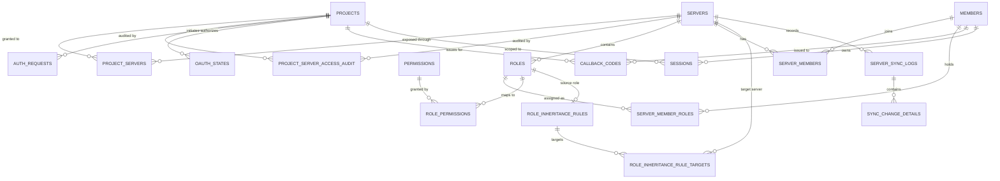

# MCDI - Current Database Architecture

> This document describes the database shape used by the current backend implementation.
> For current product requirements, see `specefication_document_mvp.md`.
> For future-phase planning and architecture direction, see `specefication_document_last_version.md`.

---

## 1. Overview

MCDI uses PostgreSQL as the primary source of truth for:

- projects and API keys
- Discord servers and synchronized members
- roles, permissions, and inheritance rules
- project/server access mappings
- OAuth flow state and callback exchange
- sessions
- sync logs and per-change diagnostics

The schema in the repository has evolved beyond the original MVP notes. This document reflects the active structure used by the current codebase.

---

## 2. Schema Overview

---

## 3. Core Table Groups

### 3.1 Project And Access Tables

#### `projects`

Stores every integrated MicroClub project.

Key columns:

- `id` (UUID PK)
- `name`
- `description`
- `api_key_hash`
- `api_key_prefix`
- `api_key_created_at`
- `api_key_last_used_at`
- `redirect_uri`
- `is_internal`
- `webhook_url`
- `is_active`

Notes:

- API key secrets are not stored in plaintext
- the current flow uses `projects` directly instead of a separate live API-key table

#### `project_servers`

Defines which projects can access which servers.

Key columns:

- `project_id`
- `server_id`
- `operations` JSONB
- `scopes` JSONB
- `created_at`
- `updated_at`

Current operations model:

- `READ`
- `SEND_MESSAGES`
- `MANAGE_WEBHOOKS`

Current scopes in active use:

- `read_members`
- `check_permissions`

#### `project_server_access_audit`

Records project/server access changes.

Key columns:

- `project_id`
- `server_id`
- `action` (`GRANT`, `UPDATE`, `REVOKE`)
- `operations_before`
- `operations_after`
- `changed_by`
- `changed_at`

---

### 3.2 Server, Member, Role, And Permission Tables

#### `servers`

Stores managed Discord guilds.

Key columns:

- `id` (Discord guild ID, PK)
- `name`
- `icon`
- `is_main`
- `type`
- `is_active`
- `sync_frequency_hours`
- `default_permission_policy`
- `disabled_reason`
- `synced_at`

#### `members`

Stores normalized Discord user identity.

Key columns:

- `id` (Discord user ID, PK)
- `username`
- `global_name`
- `display_name`
- `avatar`
- `email`
- `is_club_member`
- `is_system_admin`
- `password_hash`
- `joined_at`
- `synced_at`

Notes:

- `password_hash` exists in schema but is not the primary current admin auth path
- admin access is currently driven by Discord OAuth plus configured admin-role-ID verification

#### `server_members`

Represents membership of a member inside a specific server.

Key columns:

- `server_id`
- `member_id`
- `joined_at`
- `is_active`
- `last_synced_at`

#### `roles`

Stores synchronized Discord roles.

Key columns:

- `id` (Discord role ID, PK)
- `server_id`
- `name`
- `color`
- `position`
- `permissions_bits`
- `hierarchy_level`
- `is_global`

#### `server_member_roles`

Join table mapping members to roles.

Key columns:

- `member_id`
- `role_id`

#### `permissions`

Stores logical permission keys.

Key columns:

- `id`
- `key`
- `description`
- `bitfield`

#### `role_permissions`

Join table mapping roles to permissions.

Key columns:

- `role_id`
- `permission_id`

#### `role_inheritance_rules`

Defines permission inheritance from a source role.

Key columns:

- `id`
- `source_role_id`
- `target_scope`
- `enabled`

#### `role_inheritance_rule_targets`

Specifies which servers are targeted when inheritance is not global.

Key columns:

- `rule_id`
- `target_server_id`

---

### 3.3 OAuth, Callback, And Session Tables

#### `auth_requests`

Tracks the initial validated login request before Discord redirect.

Key columns:

- `request_id`
- `client_id`
- `redirect_uri`
- `server_id`
- `state`
- `expires_at`
- `used`

#### `oauth_states`

Stores MCDI-generated Discord OAuth states for project login.

Key columns:

- `id`
- `state`
- `project_id`
- `server_id`
- `redirect_uri`
- `client_state`
- `used`
- `expires_at`

#### `admin_oauth_states`

Stores state values for admin Discord login.

Key columns:

- `id`
- `state`
- `used`
- `expires_at`

#### `callback_codes`

Stores one-time callback code metadata used before session issuance.

Key columns:

- `id`
- `code_hash`
- `client_id`
- `redirect_uri`
- `member_id`
- `server_id`
- `expires_at`
- `used`

Notes:

- callback codes are hashed before storage
- plaintext callback codes are never persisted

#### `sessions`

Stores active member sessions.

Key columns:

- `id`
- `member_id`
- `project_id`
- `server_id`
- `token`
- `expires_at`
- `created_at`

Notes:

- sessions are scoped to a project when issued from the project login flow
- admin sessions are also represented here, but with different authorization behavior at the API layer

---

### 3.4 Synchronization Tables

#### `server_sync_logs`

Stores the lifecycle of each sync run.

Key columns:

- `id`
- `server_id`
- `status`
- `sync_type`
- `target`
- `members_synced`
- `roles_synced`
- `message`
- `started_at`
- `heartbeat_at`
- `finished_at`

#### `sync_change_details`

Stores granular entity-level changes produced during sync.

Key columns:

- `id`
- `sync_log_id`
- `server_id`
- `entity_type`
- `entity_id`
- `action`
- `description`
- `details`
- `created_at`

---

## 4. Legacy Or Transitional Tables

The repository also contains some schema elements from earlier designs:

- `oauth_clients`
- `project_scopes`

The currently active code paths primarily use:

- `projects`
- `project_servers`
- `auth_requests`
- `oauth_states`
- `callback_codes`
- `sessions`

These older tables should be treated as transitional unless future code paths rely on them again.

---

## 5. Key Design Decisions In The Current Schema

### Project Access Is Explicit

Project access is not inferred from a global role alone. It is explicitly modeled through `project_servers` so each project/server pair can carry:

- operations
- scopes
- audit history

### Identity Is Split From Membership

`members` stores user identity, while `server_members` stores participation in a given guild. This keeps multi-server support clean.

### Permissions Are Resolved From Persisted Role Data

Discord roles are synchronized into local tables, then permissions are resolved from those stored records. This allows:

- fast repeated checks
- server-scoped role evaluation
- inheritance rules without live Discord reads on every request

### OAuth Flow Uses Short-Lived State And Callback Layers

The login pipeline uses:

1. `auth_requests` for validated incoming login requests
2. `oauth_states` for Discord redirect state
3. `callback_codes` for one-time backend exchange
4. `sessions` for the final application session

This design keeps the browser-facing flow separate from backend token issuance.

### Sync Is Observable

The schema records both:

- the sync run itself in `server_sync_logs`
- individual changes in `sync_change_details`

This is important for troubleshooting and operational review.
