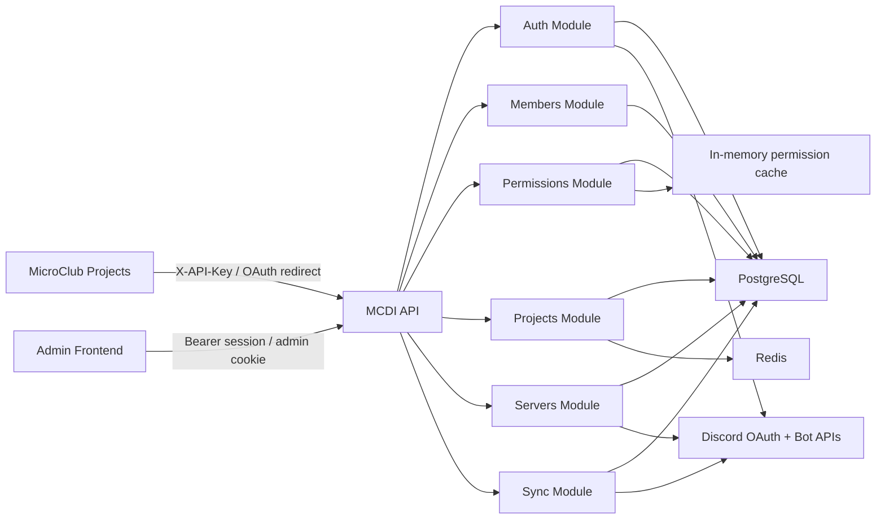
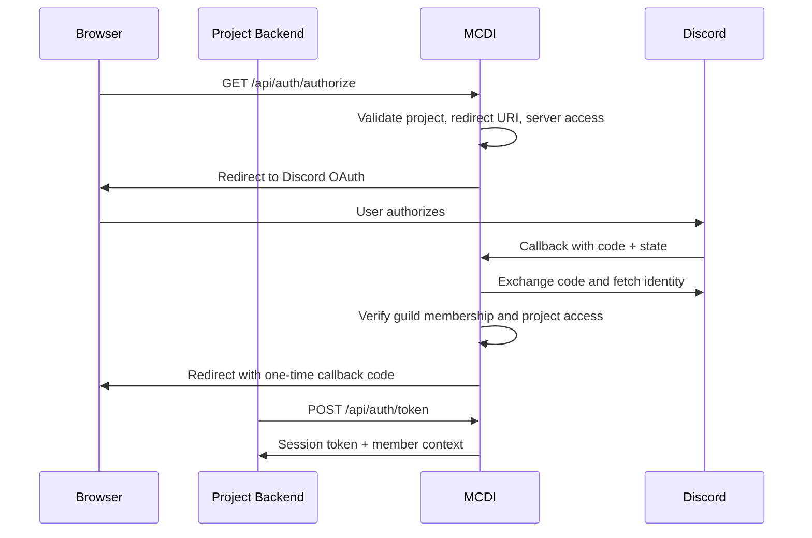
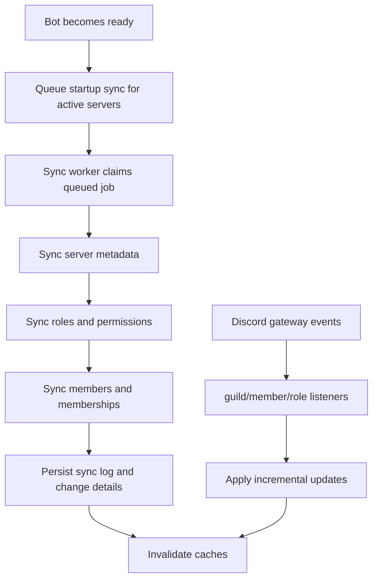

# MCDI - Architecture And Next-Phase Requirements

## MicroClub Discord Interface

> This document tracks the architecture direction and the next phases after the current implemented release.
> For the currently shipped scope, see `specefication_document_mvp.md`.
> For schema details, see `database_architecture_mvp.md`.

---

## 1. Current Architecture Baseline

The current backend already delivers the identity, synchronization, and administrative core of MCDI:

- modular NestJS API
- PostgreSQL as source of truth
- Redis-backed project caching
- Discord OAuth for projects and admins
- Discord bot synchronization for guilds, members, roles, and profile changes
- Swagger docs generated from the real controller surface

The next phases should build on this baseline instead of re-specifying a different platform shape.

---

## 2. Architecture Overview

### 2.1 Service Overview

### 2.2 Project Authentication Flow

### 2.3 Sync And Event Flow

---

## 3. Current Module Responsibilities

| Module | Responsibility | Current Status |
| --- | --- | --- |
| Authentication | OAuth flows, callback exchange, session validation, logout, admin auth | Implemented |
| Members | Server-scoped member retrieval and search | Implemented |
| Permissions | Permission checks, full resolution, inheritance-rule admin APIs | Implemented |
| Servers | Guild registration, update, activation lifecycle | Implemented |
| Projects | Project creation, API key lifecycle, redirect URI config, access matrix, access audit | Implemented |
| Sync | Startup sync, queued full sync, incremental event handling, sync logs | Implemented |
| Admin Members | Cross-server views and export | Implemented |
| Discord Operations | Direct project-facing Discord actions such as messages and webhooks | Planned |
| Observability | Project usage metrics, analytics, dashboards | Partial / Planned |
| SDK / DevTools | Language-specific integration packages | Planned |

---

## 4. Next-Phase Requirement Matrix

The old "Version 2 / Version 3" roadmap has been refreshed below so it reflects the current codebase more honestly.

| ID | Requirement | Status | Notes |
| --- | --- | --- | --- |
| F14 | Session lifecycle hardening | Partial | Sessions exist now; refresh tokens and cross-app renewal are not implemented |
| F15 | Member statistics | Planned | Cross-server exports exist, but no aggregate stats API yet |
| F16 | Role management | Partial | Inheritance rules exist; direct role-permission editing APIs are still missing |
| F17 | Send messages to channels | Planned | Operation flags exist in access mappings, but no public API yet |
| F18 | Read channel information | Planned | Discord service can read channels internally, but no project-facing API yet |
| F19 | Channel message history | Planned | Internal Discord primitives exist, but no public API or retention rules yet |
| F20 | Create webhooks | Planned | Access model reserves `MANAGE_WEBHOOKS`, but implementation is not exposed |
| F21 | Execute webhooks | Planned | Depends on webhook creation and usage tracking |
| F22 | Manage webhooks | Planned | Depends on webhook persistence and Discord sync behavior |
| F23 | Event subscriptions | Planned | Internal Discord events are consumed for sync only, not delivered to projects |
| F24 | Event delivery | Planned | Requires outbound delivery, retry queues, and webhook subscriptions |
| F25 | Monitor system usage | Partial | Sync logs and access audit exist, but no project usage dashboard |
| F26 | Audit logging | Partial | Access audit and sync logs exist; full auth/IP/action audit is not complete |
| F27 | API documentation | Implemented | Swagger is already available from the running API |
| F28 | Integration packages | Planned | No official SDK package exists yet |

---

## 5. Refined Next Requirements

### Feature Category: Authentication And Access Control

#### F14. Session Lifecycle Hardening

**Target**: extend the current session model with optional refresh tokens and stronger session introspection.

**Desired Capabilities**:

- refresh-token-based renewal for project member sessions
- session listing and revocation per member
- clearer separation between admin sessions and project sessions
- optional device or client metadata

**Why This Is Next**:

- the current project session flow is already stable
- longer-lived product integrations would benefit from refresh semantics

---

### Feature Category: Member And Permission Analytics

#### F15. Member Statistics

**Target**: turn current exports and sync data into aggregate statistics.

**Desired Capabilities**:

- total member count by server
- active vs inactive membership trends
- role distribution summaries
- club-member-only vs all-participant views
- exportable reporting snapshots

---

#### F16. Role Management

**Target**: add explicit admin APIs and UI support for role-permission management.

**Desired Capabilities**:

- list roles with permission mappings
- attach and detach permissions from roles
- view members impacted by a permission change
- preserve or enforce protected admin roles

**Current Starting Point**:

- roles are already synchronized
- permissions are already resolved
- inheritance rules already have admin endpoints

---

### Feature Category: Discord Operations

#### F17. Send Messages To Channels

**Target**: let authorized projects send Discord messages through MCDI.

**Desired Capabilities**:

- send plain text or embed payloads
- server/channel access checks before sending
- rate-limit protection
- usage tracking per project

---

#### F18. Read Channel Information

**Target**: expose safe, filtered channel metadata to projects.

**Desired Capabilities**:

- list channels the bot can access
- filter by type or category
- return metadata needed for project UIs

---

#### F19. Channel Message History

**Target**: optionally expose recent history in a controlled way.

**Desired Capabilities**:

- fetch recent messages
- filter by author or date range
- pagination
- explicit permission boundaries

---

### Feature Category: Webhook Management

#### F20. Create Webhooks

#### F21. Execute Webhooks

#### F22. Manage Webhooks

These three requirements should be implemented together because they share the same security model.

**Desired Capabilities**:

- create webhooks only where the project has explicit permission
- persist webhook metadata safely
- execute messages through managed webhooks
- rotate, disable, or delete webhooks cleanly
- record usage and failures

---

### Feature Category: Event Delivery

#### F23. Event Subscriptions

#### F24. Event Delivery

MCDI already receives Discord events for synchronization. The next step is exposing selected events to projects.

**Desired Capabilities**:

- project subscription registration
- callback signing
- retry queues
- delivery status tracking
- dead-letter or failure visibility

---

### Feature Category: System Management

#### F25. Monitor System Usage

**Target**: add system-level visibility without conflating it with sync logs.

**Desired Capabilities**:

- request counts per project
- error rate per project
- recent auth failures
- queue and sync health
- top active projects and servers

---

#### F26. Audit Logging

**Target**: broaden the current audit coverage.

**Desired Capabilities**:

- auth event audit
- admin action audit
- permission change audit
- webhook and outbound event audit
- searchable export-friendly records

---

### Feature Category: Developer Experience

#### F27. API Documentation

**Current Status**: Implemented

The running backend already generates Swagger docs from real DTOs and controllers. The next improvement here is not basic documentation, but improved examples and integration guides.

---

#### F28. Integration Packages

**Target**: reduce duplicate integration work across projects.

**Desired Capabilities**:

- lightweight server middleware
- helper client packages
- example integrations for common MicroClub stacks

---

## 6. Recommended Delivery Order

To stay aligned with the existing codebase, the recommended sequence is:

1. complete observability and audit improvements
2. add role management APIs
3. add project-facing Discord channel APIs
4. add webhook management
5. add event subscriptions and outbound delivery
6. publish integration helpers or SDKs

---

## 7. Architecture Constraints For Future Work

Any future implementation should preserve these current design constraints:

- project access must remain server-scoped
- project operations must be auditable
- gateway-driven sync must remain authoritative for member and role freshness
- Swagger docs must stay generated from the implementation, not maintained manually
- new Discord write operations must respect the same project-server permission model already in use

